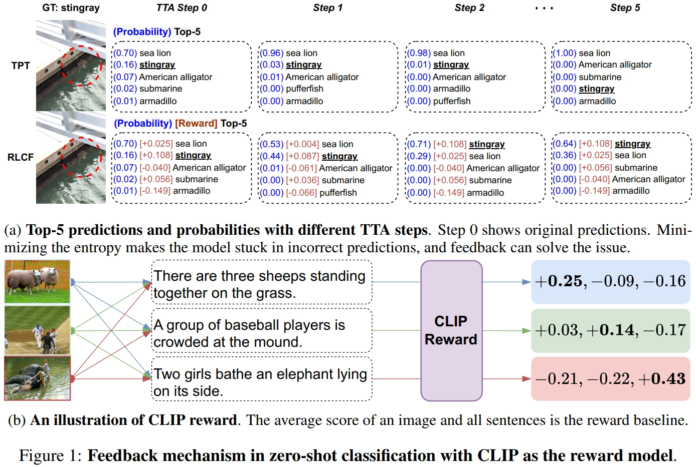
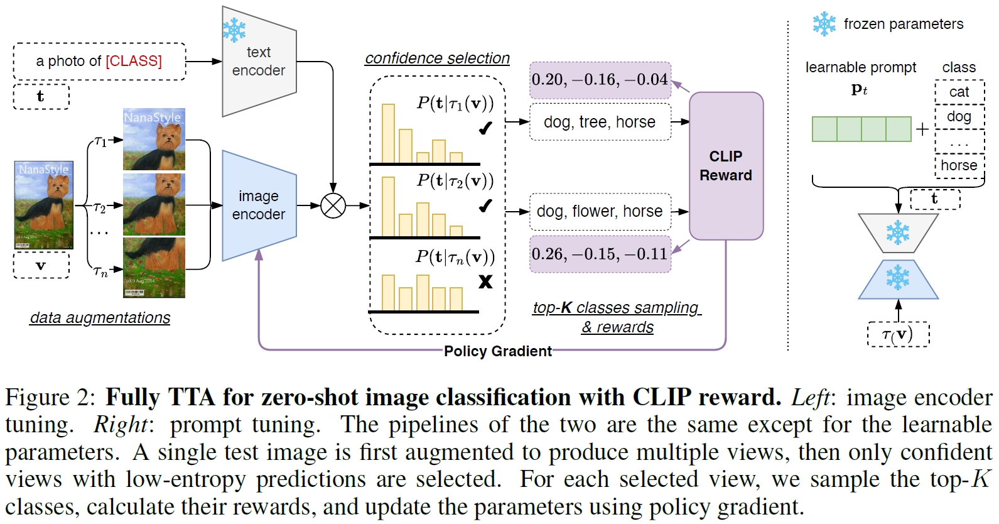
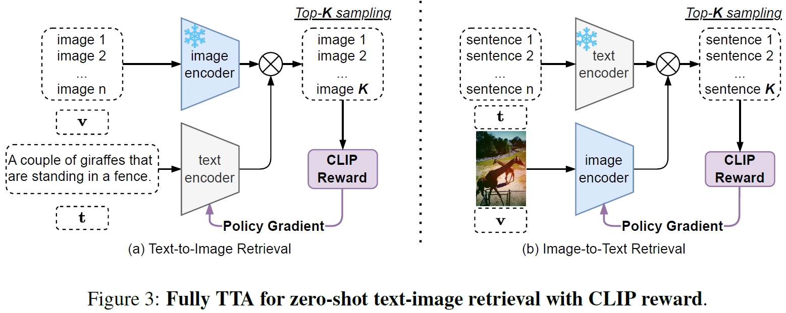
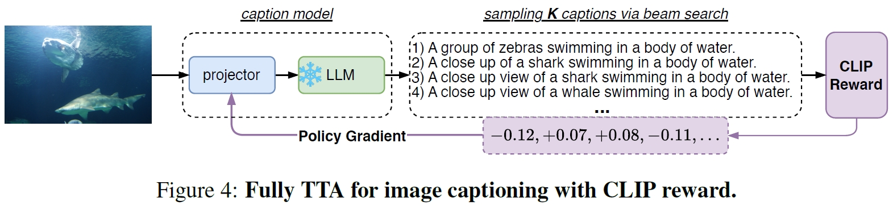

# Reinforcement Learning with CLIP Feedback :sparkles:
<!-- :sparkles: -->

The official implementation of [Test-Time Adaptation with CLIP Reward for Zero-Shot Generalization in Vision-Language Models](https://openreview.net/forum?id=kIP0duasBb).


##  Table of Contents

<!--ts-->
* [Introduction](#Introduction)
* [Features](#Features)
* [Installation](#Installation)
* [Classification](#Classification)
* [Retrieval](#Retrieval)
* [Captioning](#Captioning)
* [Citations](#Citations)
* [Acknowledgements](#Acknowledgements)
<!--te-->

## News

- [17/01/2024] repo online.


## Introduction

<div align="justify">
One fascinating aspect of pre-trained vision-language models~(VLMs) learning under language supervision is their impressive zero-shot generalization capability.
However, this ability is hindered by distribution shifts between the training and testing data.
Previous test time adaptation~(TTA) methods for VLMs in zero-shot classification rely on minimizing the entropy of model outputs, tending to be stuck in incorrect model predictions.
In this work, we propose TTA with feedback to rectify the model output and prevent the model from becoming blindly confident.
Specifically, a CLIP model is adopted as the reward model during TTA and provides feedback for the VLM.
Given a single test sample,
the VLM is forced to maximize the CLIP reward between the input and sampled results from the VLM output distribution.
The proposed <strong>reinforcement learning with CLIP feedback~(RLCF)</strong> framework is highly flexible and universal.
Beyond the classification task, with task-specific sampling strategies and a proper reward baseline choice, RLCF can be easily extended to not only discrimination tasks like retrieval but also generalization tasks like image captioning,
improving the zero-shot generalization capacity of VLMs.
According to the characteristics of these VL tasks, we build different fully TTA pipelines with RLCF to improve the zero-shot generalization ability of various VLMs.
Extensive experiments along with promising
empirical results demonstrate the effectiveness of RLCF.

<div align=center>
  </pr>
</div>

</div>


## Features

- [x] TTA for CLIP OOD classification with RLCF. Prompt tuning + backbone tuning.
- [x] TTA for CLIP retrieval with RLCF.
- [x] Training and TTA for ClipCap and CapDec.


## Installation

The code in this repo about the three tasks are independent. You can step up them task by task.

### Prepare data

First of all, you need to download the dataset and pre-trained models.

- OOD image classification dataset
  * [ImageNet](https://image-net.org/index.php)
  * [ImageNet-on-huggingface](https://huggingface.co/datasets/imagenet-1k) 
  * [ImageNet-A](https://github.com/hendrycks/natural-adv-examples)
  * [ImageNet-R](https://github.com/hendrycks/imagenet-r)
  * [ImageNet-V2](https://huggingface.co/datasets/vaishaal/ImageNetV2/tree/main)
  * [ImageNet-Sketch](https://github.com/HaohanWang/ImageNet-Sketch)
  * The code also supports fine-grained datasets used in TPT and ImageNet-C.

- Retrieval dataset (credit on [salesforce/LAVIS](https://github.com/salesforce/LAVIS/blob/main/dataset_card/coco_retrieval.md))
  * [coco2014](https://github.com/salesforce/LAVIS/blob/main/dataset_card/coco_retrieval.md)
  * [flickr30k](https://github.com/salesforce/LAVIS/blob/main/dataset_card/flickr_retrieval.md)
  * [annotations-files](https://github.com/mzhaoshuai/RLCF/releases/download/0.0.1/annotations.zip)

- Captioning dataset
  * [coco2014](https://github.com/salesforce/LAVIS/blob/main/dataset_card/coco_caption.md)
  * [nocaps](https://nocaps.org/download)
  * [annotations-files](https://github.com/mzhaoshuai/RLCF/releases/download/0.0.1/annotations.zip)

- weights of pre-trained models:
    - [CLIP-ViT-B/32](https://openaipublic.azureedge.net/clip/models/40d365715913c9da98579312b702a82c18be219cc2a73407c4526f58eba950af/ViT-B-32.pt)
    - [CLIP-ViT-B/16](https://openaipublic.azureedge.net/clip/models/5806e77cd80f8b59890b7e101eabd078d9fb84e6937f9e85e4ecb61988df416f/ViT-B-16.pt)
    - [CLIP-ViT-L/14](https://openaipublic.azureedge.net/clip/models/b8cca3fd41ae0c99ba7e8951adf17d267cdb84cd88be6f7c2e0eca1737a03836/ViT-L-14.pt)
    - [RN50x64](https://openaipublic.azureedge.net/clip/models/be1cfb55d75a9666199fb2206c106743da0f6468c9d327f3e0d0a543a9919d9c/RN50x64.pt)
    - [facebook/opt-125m](https://huggingface.co/facebook/opt-125m)
    - [CoOp Weights](https://drive.google.com/file/d/18ypxfd82RR0pizc5MM1ZWDYDk4j0BtPF/view)
    - [weights-of-ClipCap](https://github.com/mzhaoshuai/RLCF/releases/download/0.0.1/capdec_opt125m_transformer_coco_01.zip) Put them at the `${ROOT}/output`.
    - [weights-of-CapDec](https://github.com/mzhaoshuai/RLCF/releases/download/0.0.1/clipcap_opt125m_transformer_coco_01.zip) Put them at the `${ROOT}/output`.

- For convenient, you can also download all the datasets at BaiduYunPan. Please only use for research or education purposes.
  * [BaiduYunPan RLCF](https://pan.baidu.com/s/1HStpgyMFLYUjgJLh6ZI14w?pwd=d653), code is `d653`.


Generally, directories are organized as follows:
```
${ROOT}
├── dataset
│   │
│   ├──tta_data
│   │   ├──ImageNet
│   │   ├──imagenet-a
│   │   ├──imagenet-r
│   │   ├──ImageNet-Sketch
│   │   └──imagenetv2-matched-frequency-format-val
│   │       
│   ├──coco2014
│   ├──nocaps
│   └──flickr30k
│
├── code
│   └── RLCF
│       ├──caption
│       ├──clipscore
│       ├──retrieval
│       └──TPT  
│ 
├── output (save the output of the program)
│
│
├── pretrained
│       ├──opt-125m
│       ├──coop
│       │    └──coop_16shots_nctx4_cscFalse_ctpend_vitb16_seed1
│       │
│       └── clip (download the CLIP pre-trained weights and put them here)
│            └── ViT-B-16.pt
│
...
```

### Dependency

Requires `Python >= 3.8` and `PyTorch >= 1.12`.
The following commands are tested on a Linux machine with CUDA Driver Version `525.105.17` and CUDA Version `11.7`.
```
conda create --name rlcf python==3.8
pip install -r requirements.txt 
```
I use
```
torch==1.13.1+cu117
torchvision==0.14.1+cu117
--extra-index-url https://download.pytorch.org/whl/cu117
```
in the requirements file.

If you use other versions of cuda, simply remove them (the last 3 lines in the txt file) in `requirements.txt` then do
```
conda create --name rlcf python==3.8
conda install pytorch==1.13.1 torchvision==0.14.1 -c pytorch
pip install -r requirements.txt 
```


## Classification
<div align=center>
  </pr>
</div>

- Before training, you should set the path properly. **Change all `root` variables in `TPT/scripts/*.sh` to you path.**
- Set up the directory of CLIP in the python files properly. Variables `DOWNLOAD_ROOT_v2` in `TPT/clip_reward.py` and `TPT/clip/custom_clip.py`.

Then you can `cd TPT/scripts`,
- For test-time prompt tuning with CLIP reward, refer to
```
bash rlcf-prompt.sh 0
```
To evaluate on ImageNet, ImageNet-V2, and ImageNet-Sketch (which has 1000 classes), you will need a GPU with more than (not including) 16GB memory. 


- For test-time CLIP image encoder tuning with CLIP reward, refer to
```
bash rlcf-tune.sh 0
```
A 16GB GPU card should be enough.


## Retrieval
<div align=center>
  </pr>
</div>

- Before training, you should set the path properly. **Change all `root` variables in `retrieval/scripts/*.sh` to you path.**
- Set up the directory of CLIP in the config and python files properly.
  * global search `/YOUR/PATH` in the `retrieval` directory, and change `/YOUR/PATH` to your path.
  * To name a few, `retrieval/lavis/models/clip_models/pretrained.py`, `retrieval/lavis/configs/datasets/coco` and `flickr30k`, `retrieval/clip_rewards.py`, `retrieval/custom_models.py`, ... 

Then you can `cd retrieval/scripts`,
- For test-time CLIP image encoder tuning with CLIP reward on COCO2014, refer to
```
bash tta_coco_ret.sh 0
```

- For test-time CLIP image encoder tuning with CLIP reward on flickr30k, refer to
```
bash tta_flickr_ret.sh 0
```

## Captioning
<div align=center>
  </pr>
</div>

- Before training, you should set the path properly. **Change all `root` variables in `caption/scripts/*.sh` to you path.**
- Set up the directory of CLIP in the python files properly.
  * global search `/YOUR/PATH` in the `caption` directory, and change `/YOUR/PATH` to your path.
  * To name a few, `caption/clip_rewards.py`...
 
Then you can `cd caption/scripts`,
- For TTA with CapDec, COCO --> flickr30k or COCO --> Nocaps,  refer to
```
bash tta_capdec_c2f.sh 0
bash tta_capdec_c2n.sh 0
```

- For TTA with ClipCap, COCO --> flickr30k or COCO --> Nocaps, refer to
```
bash tta_clipcap_c2f.sh 0
bash tta_clipcap_c2n.sh 0
```

- For training with ClipCap or CapDec on COCO, refer to
```
bash train_capdec_coco.sh 0
bash train_clipcap_coco.sh 0
```
You need to download the [CLIP-features-for-coco](https://github.com/mzhaoshuai/RLCF/releases/download/0.0.1/COCO_train_set_image_text_vitb16_v2.zip) or [CLIP-features-for-flikcr](https://github.com/mzhaoshuai/RLCF/releases/download/0.0.1/flickr_train_set_image_text_vitb16_v2.zip) before training.


- For the evaluation of captioning results, we adopt the scripts from `clipscore`. It includes `Bleu`, `Meteor`, `Rouge`, `Cider`, `CLIPScore`. If you want to get `Spice`, try to uncomment line25 in `clipscore/generation_eval_utils.py`.


## Citations
```
@inproceedings{
zhao2024testtime,
title={Test-Time Adaptation with {CLIP} Reward for Zero-Shot Generalization in Vision-Language Models},
author={Shuai Zhao and Xiaohan Wang and Linchao Zhu and Yi Yang},
booktitle={The Twelfth International Conference on Learning Representations},
year={2024},
url={https://openreview.net/forum?id=kIP0duasBb}
}
```


## Acknowledgements

This repo is built upon these previous works.

<!--ts-->
* [azshue/TPT](https://github.com/azshue/TPT)
* [openai/CLIP](https://github.com/openai/CLIP)
* [mlfoundations/open_clip](https://github.com/mlfoundations/open_clip)
* [huggingface/transformers](https://github.com/huggingface/transformers)
* [salesforce/LAVIS](https://github.com/salesforce/LAVIS)
* [KaiyangZhou/CoOp](https://github.com/KaiyangZhou/CoOp)
* [j-min/CLIP-Caption-Reward](https://github.com/j-min/CLIP-Caption-Reward)
* [rmokady/CLIP_prefix_caption](https://github.com/rmokady/CLIP_prefix_caption)
* [DavidHuji/CapDec](https://github.com/DavidHuji/CapDec)
* [mzhaoshuai/CenterCLIP](https://github.com/mzhaoshuai/CenterCLIP)
* [VamosC/CoLearning-meet-StitchUp](https://github.com/VamosC/CoLearning-meet-StitchUp)
* [VamosC/CLIP4STR](https://github.com/VamosC/CLIP4STR)
<!--te-->

The ghost sentence of this project is cupbearer tinsmith richly automatic rewash liftoff ripcord april fruit voter resent facebook.
