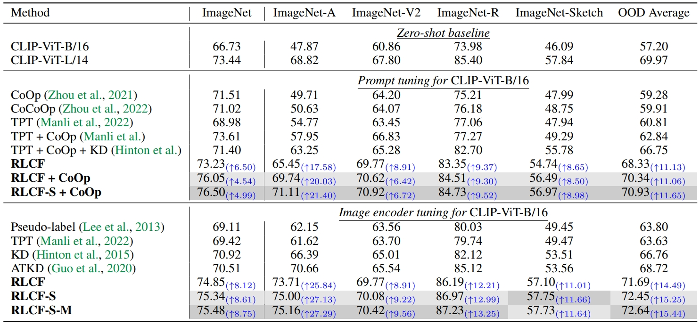
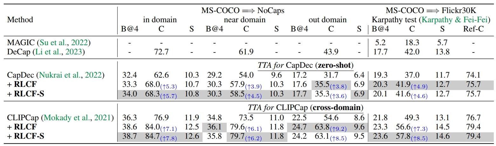
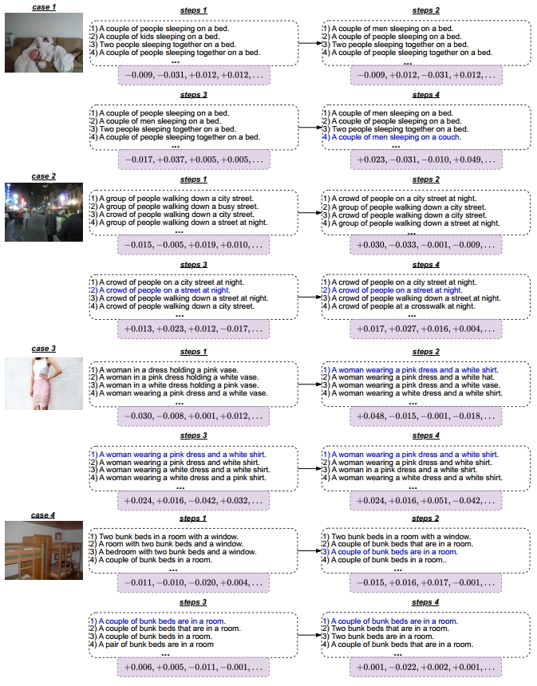

---
# Feel free to add content and custom Front Matter to this file.
# To modify the layout, see https://jekyllrb.com/docs/themes/#overriding-theme-defaults

layout: home
---

# Test-Time Adaptation with CLIP Reward for Zero-Shot Generalization in Vision-Language Models

### [Shuai Zhao]()1,2, [Xiaohan Wang](https://scholar.google.com/citations?user=iGA10XoAAAAJ&hl=en-US)1, [Linchao Zhu](http://ffmpbgrnn.github.io/)1, [Yi Yang](https://scholar.google.com/citations?user=RMSuNFwAAAAJ&hl=en)1
### 1 ReLER Lab, CCAI, Zhejiang University, 2 Baidu Inc.
### [<ins>paper</ins>]()
<!-- ### [<ins>paper</ins>]() &nbsp; [<ins>code</ins>](https://github.com/azshue/TPT) -->

<strong><em>Abstract</em></strong>: 
  Misalignment between the outputs of a vision-language (VL) model and task goal hinders its deployment. This issue can worsen when there are distribution shifts between the training and test data. To address this problem, prevailing fully test-time adaptation~(TTA) methods bootstrap themselves through entropy minimization.
  However, minimizing the entropy of the predictions makes the model overfit to incorrect output distributions of itself.
  <strong>In this work, we propose TTA with feedback to avoid such overfitting and align the model with task goals.</strong>
  <strong>Specifically, we adopt CLIP as reward model to provide feedback</strong> for VL models during test time in various tasks, including image classification, image-text retrieval, and image captioning.
  Given a single test sample, the model aims to maximize CLIP reward through reinforcement learning. We adopt a reward design with the average CLIP score of sampled
  candidates as the baseline. This design is simple and surprisingly effective when combined with various task-specific sampling strategies. The entire system is flexible, allowing the reward model to be extended with multiple CLIP models.
  Plus, a momentum buffer can be used to memorize and leverage the learned knowledge from multiple test samples. Extensive experiments demonstrate that our method significantly improves different VL models after TTA.
  

<h2 id="rlcf"><strong>Reinforcement learning with CLIP feedback</strong></h2>

We design a general TTA pipeline with CLIP feedback for different vision-language tasks. Our goal is to maximize
    the CLIP reward for each test sample. We use the average CLIP score of sampled image-text pairs as the baseline for the reward function.
    The CLIP(<strong>t</strong>,<strong>v</strong>) function returns the similarity score of the text <strong>t</strong> and image <strong>v</strong>.
    

  <strong>Figure 1.</strong> Reinforcement learning with CLIP feedback (<strong>RLCF</strong>).

Figure 2 presents an example of our CLIP reward, which uses the average score of image-text pairs as the baseline.
A positive score for an image-text pair indicates that CLIP ranks their similarity higher than the average among the sampled pairs.
During TTA, the VL model aims to produce a high positive score and avoid producing results with negative scores. 

  
  

  

    <strong>Figure 2.</strong> An example of CLIP reward.
  

 

  
<h2 id="task-specific"><strong>Task-specific fully test-time adaptation with RLCF</strong></h2>
The RLCF method described above is general and applicable to various multi-modal tasks.
However, the VL models and sampling strategies differ across tasks.
Next, we will introduce our task-specific fully TTA frameworks.

 

<h3 id="classification"><strong>Image classification on out-of-distribution (OOD) data</strong></h3>
Figure 3 illustrates the fully TTA pipeline for image classification with RLCF. For convenience, we just choose CLIP as the classifier.

  
  

  

    <strong>Figure 3.</strong> Fully test-time adaptation for image classification with CLIP reward.
    Left: test-time image encoder tuning. Right: test-time prompt tuning.
    The pipelines of the two are the same except for the learnable parameters.
    A single test image is first augmented to produce multiple views, then only confident views with low-entropy predictions are selected.
    For each selected view, we sample the top-K classes, calculate their rewards, and update the parameters using policy gradient.
  

 

<h3 id="retrieval"><strong>Zero-shot image-text retrieval</strong></h3>
The fully TTA pipeline for retrieval with RLCF is presented in Figure 4. CLIP serves as the zero-shot retrieval model.
During TTA for text-to-image retrieval, the image encoder remains fixed, while the text encoder is frozen in the other case.
This avoids redundant feature computation for the numerous images or text in the candidate set. 

  
  

  

    <strong>Figure 4.</strong> Fully test-time adaptation for image-text retrieval with CLIP reward.
  

  
 

<h3 id="captioning"><strong>Cross-domain image captioning</strong></h3>
Figure 5 illustrates the fully TTA pipeline for image captioning with RLCF.
In this work, we adopt two methods: CLIPCap, a supervised approach, and CapDec, a weakly supervised approach.
Both methods are built upon large language models, and an OPT- 125M is utilized for text generation.
Both models utilize a projector (e.g., an MLP or transformer) to project CLIP embedding into the token embedding space of the LLM.

  
  

  

    <strong>Figure 5.</strong> Fully test-time adaptation for image captioning with CLIP reward.
  

 

<h2 id="evaluation"><strong>Experiments</strong></h2>
For variants of our method, <strong>RLCF</strong> uses a CLIP-ViT-L/14 as the reward model,
<strong>RLCF-S</strong> adopts weighted reward sum of {CLIP-ViT- L/14-336, CLIP-ViT-L/14, CLIP-RN50x64},
and <strong>RLCF-S-M</strong> adds the momentum buffer.
Check the paper for more details.

 

<h3 id="exp-classifications"><strong>Image classification on OOD data</strong></h3>

  <strong>Table 1.</strong> Top-1 accuray of image classification with TTA on OOD data.
  The best and second- best results are emphasized. KD uses a CLIP-ViT-L/14 as the teacher.
  RLCF (RN50x4) use a CLIP-RN50x4 as the reward model. Improvement before and after TTA with RLCF is in blue.

  

The top-1 accuracy is presented in Table 1. RLCF clearly outperforms the baseline and previous methods.
Notably, on ImageNet-A/V2/R, RLCF with the CLIP-ViT-B/16 as the TTA model even surpasses the performance of the reward model — CLIP-ViT-L/14.

Figure 6 visualizes CLIP-ViT-B/16 image embedding with and without RLCF via t-SNE. 
After tuning the image encoder, intra-class distance decreases and inter-class distance increases, leading to separate tight clusters.
This results in a 25.84% improvement in top-1 accuracy on ImageNet-A.

  

  <strong>Figure 6.</strong> Visulization of image embedding using t-SNE. Left: CLIP-ViT-B/16, Right: CLIP-ViT-B/16 + RLCF.

 

<h3 id="exp-retrieval"><strong>Zero-shot image-text retrieval</strong></h3>
Table 2 presents the retrieval results on MS-COCO and Flickr30K.
RLCF demonstrates significant improvement compared to the zero-shot baseline and even outperforms the most powerful CLIP-ViT-L/14-336.

  <strong>Table 2.</strong> Test-time adaptation for zero-shot image-text retrieval.
  KD uses CLIP-ViT-L/14 as the teacher model. Improvement of Recall@1 before and after TTA with RLCF is in blue.

  

 

<h3 id="exp-caption"><strong>Cross-domain image captioning</strong></h3>
Table 3 presents results for cross-domain image captioning.
For all metrics, both CapDec and CLIPCap with RLCF significantly improve upon the baselines.
This demonstrates the strong generalization ability of RLCF in image captioning, even with a single test sample.

  <strong>Table 3.</strong> Test-time adaptation for cross-domain image captioning.
  Metrics B@4 for BLEU@4, C for CIDEr, S for SPICE, and Ref-C for RefCLIPScore.
  The gain of CIDEr is shown in blue.

  

We show captioning samples and intermediate-generated captions in Figure 7.
The visualization reveals that CLIP favors captions that provide a holistic description of the image.
Through RL, the generation of such captions is encouraged.
In Figure 7, as the process progresses, captions aligned with preferences of CLIP are given higher priority during generation.

    
  

  

    
  

  <strong>Figure 7.</strong> Intermediate generated captions and reward of CLIPCap with RLCF.
  The sampling factor K = 10, only 4 candidates are shown here. The final generated caption is in blue.

 

<h2 id="citation">Citation</h2>

If you find our work useful, please consider citing:

<pre class="highlight"><code>@article{zhao2023rlcf
    title={Test-Time Adaptation with CLIP Reward for Zero-Shot Generalization in Vision-Language Models},
    author={Shuai, Zhao and Xiaohan, Wang and Linchao, Zhu and Yi, Yang},
    journal={arXiv preprint},
    year={2023}
}
</code></pre>

<!-- <h2 id="contact">Contact</h2>

For any questions, please contact Mr. Shuai Zhao (zhaoshuaimcc@gmail.com).
 -->

## Contact
---
For any questions, please contact Mr. Shuai Zhao (zhaoshuaimcc@gmail.com).

